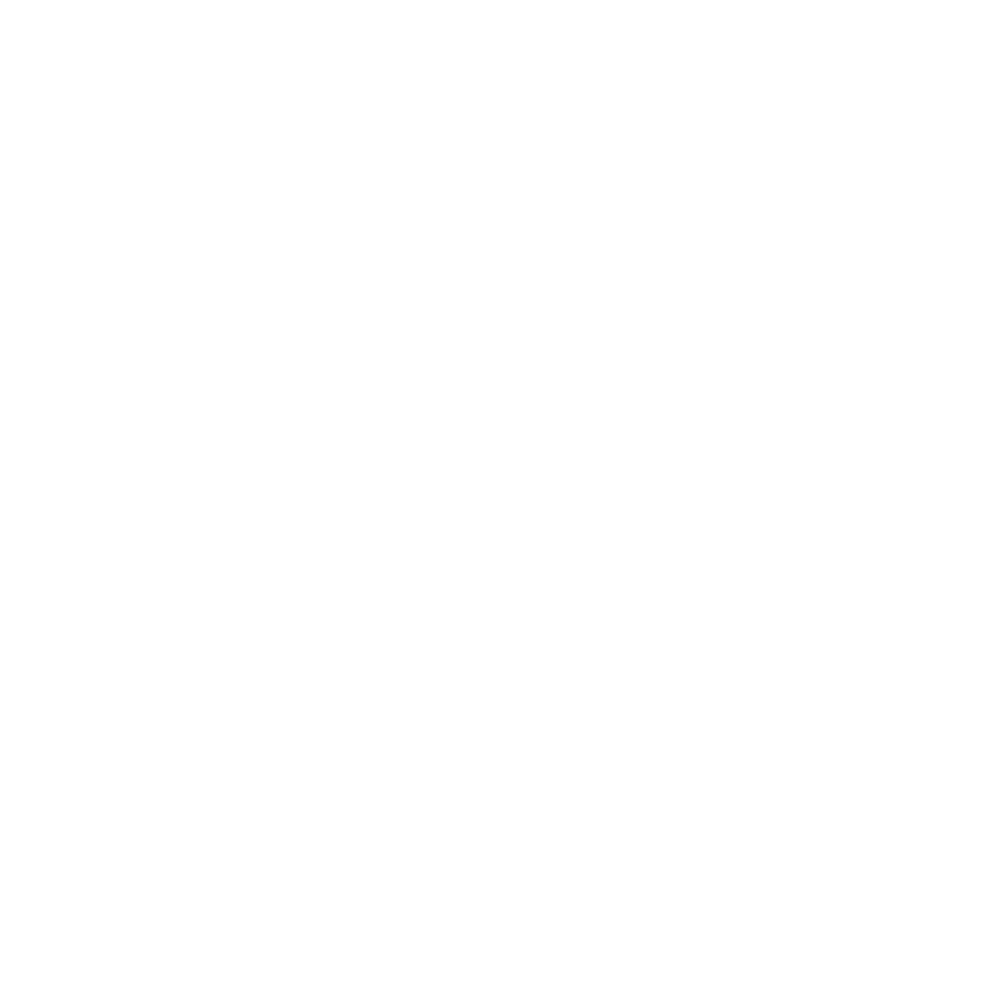

# kbmouse

<p align="center">
  
</p>

`kbmouse` is a small keyboard-driven virtual mouse for Windows, macOS, and X11 Linux.
Tap Caps Lock, type the label shown over a screen region, and the pointer jumps
there. It is inspired by [warpd](https://github.com/rvaiya/warpd).

This repository is a beta. Windows is the primary platform. The platform-neutral
engine and X11 backend are tested on Linux; the Win32 backend must still be
manually exercised on a Windows desktop before a production release. The macOS
backend also needs the desktop checks below before a production release.

## Controls

1. Tap `Caps Lock` to display the grid, or hold it to use Normal Mode as a
   momentary keyboard layer. Caps Lock is swallowed while kbmouse is running,
   so it does not toggle the normal Caps Lock state.
2. The grid opens on the monitor containing the currently focused window. Type
   a complete label to move to that cell.
3. In normal mode:
   - `Space`: subdivide the selected cell for a more precise jump
   - `h`, `j`, `k`, `l`: nudge left, down, up, right; hold one horizontal and
     one vertical key together for diagonal movement
   - `m`, `,`, `.`: left, middle, right click
   - While holding Caps Lock, hold `m` to keep the left button down for
     selecting text or dragging; release `m` to drop
   - `v`: begin/end a left-button drag
   - `e`, `d`: scroll up/down
   - `Esc`: return to idle

For quick mouse control, hold Caps Lock, use any Normal Mode keys, then release
Caps Lock. A short Caps Lock press without another key opens the grid. Holding
Caps Lock longer than `leader_tap_ms` without using it does nothing on release.

All controls are configurable.

## Install a release

- **macOS:** open the DMG and drag **kbmouse.app** into **Applications**. Launch it
  there and grant Accessibility and Input Monitoring permissions. Quit kbmouse
  and remove the app from Applications to uninstall; configuration is preserved.
- **Windows:** run the `-setup.exe` installer. It installs for your user, creates
  a Start menu shortcut, and optionally a desktop shortcut. Uninstall through
  Windows Settings → Apps. Quit kbmouse through the tray before reinstalling.
- **Linux (X11):** extract the `.tar.gz` release and run `./install.sh`. The app
  installs in `~/.local/lib/kbmouse`, with a launcher in `~/.local/bin` and an
  application-menu entry. Uninstall using `~/.local/lib/kbmouse/uninstall.sh`.
  Configuration is preserved. No root privileges are needed.

Portable archives also contain the executable (or the complete macOS app).

### Build installation packages

Packaging requires Python 3.9+. Build the target first, then run:

```sh
cargo build --release --target aarch64-apple-darwin
python3 scripts/package.py --target aarch64-apple-darwin --installer
```

Use `x86_64-apple-darwin` for Intel Macs, `x86_64-pc-windows-msvc` for Windows,
or `x86_64-unknown-linux-gnu` for Linux. Outputs go to `dist/`. Windows installer
builds require Inno Setup 6 (`iscc`); macOS DMG builds require Apple's Command
Line Tools. Build each installer on its own operating system. Linux archives
include the installer and uninstaller scripts.

For an existing native `cargo build --release`, add
`--binary target/release/kbmouse` (or `kbmouse.exe` on Windows).
Local Mac packages are ad-hoc signed for testing. For public distribution, use
`--sign-identity "Developer ID Application: ..." --notary-profile PROFILE` with
credentials previously stored using `xcrun notarytool store-credentials`.
The packaging script signs and notarizes the app before archiving it, and also
signs/notarizes the DMG. Local ad-hoc packages are not notarized releases.

## Build

Install a current stable Rust toolchain, then:

```sh
cargo build --release
cargo test
```

The executable is `target/release/kbmouse` (`kbmouse.exe` on Windows).

### Windows

Build on Windows with the MSVC Rust toolchain:

```powershell
cargo build --release
.\target\release\kbmouse.exe
```

The release executable has no console window. Start it from PowerShell with
`--verbose` while diagnosing startup problems, or use a debug build. An
unelevated kbmouse cannot control elevated applications; run it as administrator
if that is required.

To cross-compile a Windows executable from Ubuntu or WSL:

```sh
sudo apt install mingw-w64
rustup target add x86_64-pc-windows-gnu
cargo build --release --target x86_64-pc-windows-gnu
```

The result is `target/x86_64-pc-windows-gnu/release/kbmouse.exe`.

### macOS

Build natively on Apple Silicon or Intel with Rust and Apple's Command Line Tools:

```sh
xcode-select --install  # only if the tools are not already installed
cargo build --release
./target/release/kbmouse
```

The macOS backend is written in Rust using AppKit, Core Graphics, and IOKit
bindings. Cargo builds it directly, with no Objective-C sources, custom native
build script, helper process, or additional runtime to install. Build on macOS
with the Apple SDK and linker provided by the Command Line Tools.

Before running, grant **Accessibility** and **Input Monitoring** access to
kbmouse (or the terminal launching it) under **System Settings → Privacy &
Security**. Restart kbmouse after changing permissions. Input Monitoring is
required for the physical Caps Lock press/release events used by tap-and-hold
control; Accessibility is required to capture keys and control the mouse.
Startup reports which permission is missing.

The default leader is **Caps Lock**, just like Windows and Linux. Tap it for the
grid, or hold it for momentary mouse control. No key remapping or third-party
utility is required. The backend observes raw keyboard HID values for physical
press/release and separately suppresses the macOS logical Caps Lock toggle,
preserving the lock state from when capture started. Other modifier keys keep
their normal behavior. If Caps Lock has already been remapped by another utility,
remove that remap before using it as the native leader.

If an earlier build created your configuration with `leader = "f9"`, choose
**Caps Lock** in Settings → General → Leader key and save, or change the config
to `leader = "capslock"` and restart. Existing explicit settings are preserved.
F9 remains an optional leader; only Caps Lock needs raw HID Input Monitoring.

The overlay is transparent, does not take focus, and ignores mouse clicks.
Coordinates and movement distances use macOS screen points, including on Retina
displays. The focused window selects the monitor, with the pointer's monitor as
a fallback; `span_all_monitors` covers the desktop. Bindings use physical ANSI
key positions, so non-US keyboard layouts may show different key legends.
Closing settings exits kbmouse and releases held mouse buttons. `--hint` also
works without opening settings. Secure Input can prevent global keyboard capture.

### Linux

The beta Linux backend requires an X11 session and the XTest and XFixes server
extensions. Wayland is not supported. On Wayland, use an X11 session for now;
a future layer-shell one-shot backend can make `kbmouse --hint` suitable for
compositor keybindings.

## Usage

```text
kbmouse [--hint] [--config PATH] [--verbose]
```

- `--hint` opens hint mode immediately and exits after that interaction.
- `--config` selects a nonstandard configuration file.
- `--verbose` enables debug logs.

On first launch, kbmouse creates `%APPDATA%\kbmouse\config.toml` on Windows or
`~/.config/kbmouse/config.toml` on Linux. On macOS it creates
`~/Library/Application Support/kbmouse/config.toml`.

## Settings window and tray

Normal startup opens an egui settings window while keyboard control runs on a
background thread. The General, Appearance, and Controls pages cover the common
configuration options. Select **Save settings** to persist and immediately apply
the new configuration. Saving safely exits any active hint, movement, or drag
mode before switching settings.

The Controls page includes both the default Vim `HJKL` movement layout and an
arrow-style `IJKL` preset (`I` up, `J` left, `K` down, `L` right). Selecting a
preset updates the editable direction bindings.

On Windows, closing the settings window hides it instead of stopping kbmouse.
Left-click the kbmouse notification-area icon to reopen settings. Right-click it
for the menu containing the Quit command.
On Linux and macOS, closing the window exits the application.

## Example configuration

```toml
leader = "capslock"
hold_leader_for_normal = true
leader_tap_ms = 200
label_style = "sequences"
alphabet = "asdfghjkl;qwertyuiop"
target_cell_px = 100
backdrop_opacity = 90
background_color = "#111827"
grid_color = "#64748b"
text_color = "#ffffff"
accent_color = "#38bdf8"
high_contrast_labels = true
crisp_labels = false
label_glow = false
font_size = 22
post_hint = "normal"
exit_on_click = true
hold_click_to_drag = true
move_step = 8
hold_move_step = 24
smooth_movement = false
magnet_enabled = false
magnet_avoid_repeat = false
magnet_radius = 56
scroll_step = 120
span_all_monitors = false

[keys]
left = "h"
down = "j"
up = "k"
right = "l"
left_click = "m"
middle_click = ","
right_click = "."
drag = "v"
scroll_up = "e"
scroll_down = "d"
subdivide = "space"
```

Set `grid_rows` and `grid_cols` to explicit positive integers if you do not want
the automatic approximately-100-pixel cells. `post_hint` accepts `normal`,
`click`, or `exit`.

Set `label_style = "words"` or choose **Three-letter words** in the General page
to replace generated key sequences with recognizable labels such as `ace`,
`cat`, and `sun`. Word mode may reduce grid density on very large displays so
every label remains a unique three-letter word.

Enable **Smooth acceleration** under Settings → Controls for granular direction
key taps that accelerate into fluid movement when held. It is experimental and
disabled by default so the constant-speed mode remains available for users who
prefer predictable pixel movement.

Enable **Magnetized cursor** under Settings → Controls to make the pointer snap
to a nearby accessible button, link, menu item, text field, or similar control
after a direction key is released or a grid jump finishes. The radius is
adjustable from 16–160 pixels. This experimental feature is disabled by default
and currently works only on Windows through UI Automation; custom-rendered
controls that do not expose accessibility information may not be detected.
Enable **Avoid repeat snap** to prevent the last snapped control from pulling the
pointer back while you move away. That control becomes eligible again after the
pointer travels beyond the configured snap radius.

## Manual beta checklist

### Windows

- Type in Notepad, summon and dismiss kbmouse, then continue typing. The overlay
  must not steal focus or lose ordinary keystrokes.
- Verify Caps Lock's state and LED do not toggle while kbmouse runs, and that
  Caps Lock works normally after kbmouse exits.
- Verify all click types, scrolling, drag release on `Esc`, and two-stage
  subdivision.
- Verify a secondary monitor to the left of the primary (negative coordinates).
- Verify mixed 100%/150% DPI monitors and an elevated app.
- Enable Magnetized cursor and verify snapping near standard buttons and links,
  with no movement when no supported control is within the configured radius.
- Force-terminate kbmouse while the overlay is open. Windows must remove the hook
  and normal keyboard behavior must return.

### macOS

- Verify permission-denied startup for Accessibility and Input Monitoring,
  then enable both and restart.
- In TextEdit, tap Caps Lock, select a cell, click, and resume typing. The overlay must
  not steal focus or intercept clicks; idle keystrokes must reach TextEdit.
- Hold Caps Lock for movement and dragging; verify release, Escape, closing settings,
  and saving settings all release the mouse button.
- Verify middle/right clicks, both scroll directions, subdivision, and `--hint`.
- Test Retina and non-Retina displays, displays above/left of the primary,
  `span_all_monitors`, Spaces, and full-screen applications.
- Test repeated Caps Lock taps and holds with the lock initially both off and on;
  verify ordinary typing retains the initial lock state and Caps Lock works normally
  after exiting. Check built-in and external keyboards, including unplugging a
  keyboard while the leader is held.

### X11

- Confirm the XTest and XFixes extensions are present (`xdpyinfo -queryExtensions`).
- Verify the overlay does not receive pointer clicks and does not focus itself.
- Verify another application receives all keys while kbmouse is idle.

## Known beta limitations

- Editing `config.toml` manually still requires a restart; GUI saves apply live.
- The tray icon is currently Windows-only.
- Magnetized cursor is Windows-only; Linux requires a future AT-SPI2 backend.
- No Wayland backend. macOS magnet snapping is not implemented.
- X11 uses the server's core bitmap font and a solid backdrop.
- Multi-monitor selection on X11 currently uses the root screen as one desktop.
- Key movement uses operating-system key repeat rather than time-based animation.

## Updating

Open **Settings → Updates** to check for releases, download and install an update,
and restart kbmouse. Checks run in the background at startup and every 24 hours;
the checkbox on this page disables automatic checks. Downloads and installation
require clicking **Download and install update**. Configuration is preserved.

The same updater is available without starting keyboard capture:

```sh
kbmouse --check-update
# Quit the running app first:
kbmouse --update
```

Official builds use `self_update` with an embedded Ed25519 public key. Every update
archive must carry a valid signature bound to its exact filename. Unsigned,
tampered, older, and prerelease updates are rejected. macOS updates replace the
whole `.app` and verify its code signature before replacement; Windows and Linux
replace the executable. Restart releases keyboard capture and the single-instance
lock before launching the installed version.

Updates support Apple Silicon and Intel macOS app bundles, x64 Windows, and x64
Linux direct installations. The destination must be writable by your user. Linux
package-manager installations should use their package manager. On macOS, copy
the app out of the DMG before updating; use `~/Applications` if `/Applications`
is not writable. A development build without `KBMOUSE_UPDATE_PUBLIC_KEY` set at
compile time has updates disabled. This value is the signing key's 64-character
hexadecimal public key, never the private signing key.
